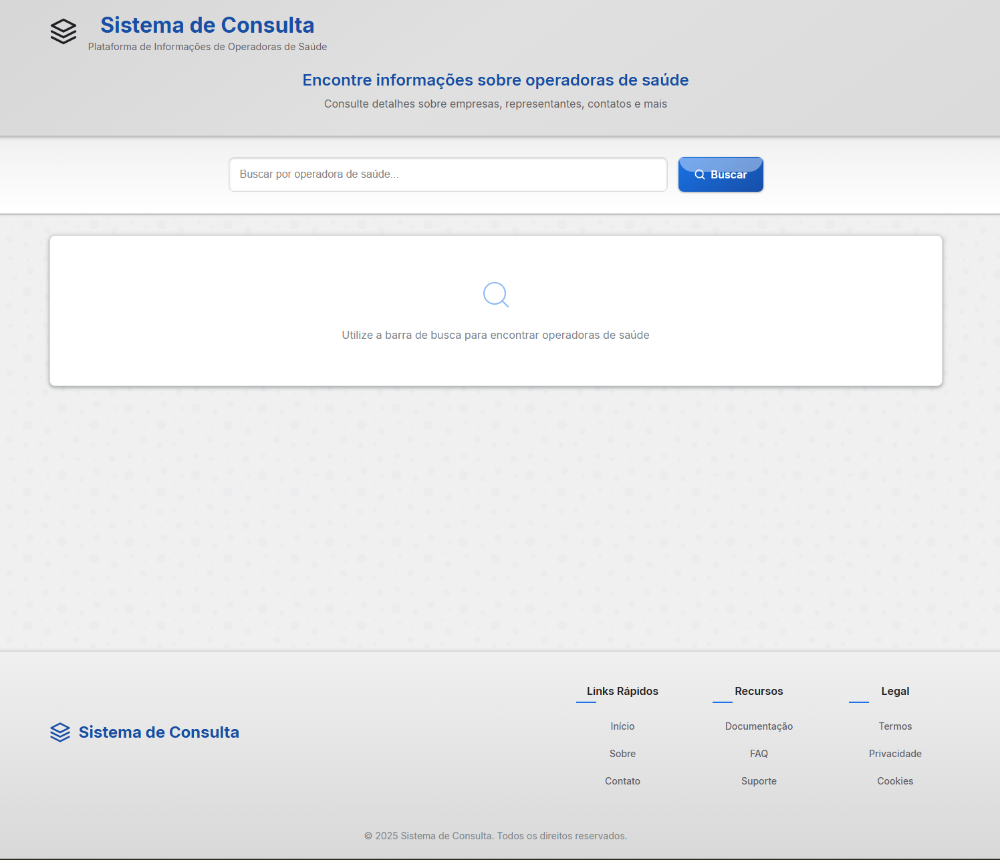

# Sistema de Consulta - Operadoras de Saúde

Um sistema de busca moderno e responsivo para consultar informações sobre operadoras de saúde no Brasil.

## 📋 Sobre o Projeto

Este sistema permite aos usuários pesquisar operadoras de saúde e visualizar informações detalhadas sobre cada uma delas, incluindo dados cadastrais, endereço, contato, e representação legal. A aplicação foi projetada com foco na experiência do usuário, utilizando um design skeuomorfico que proporciona uma interface clean e intuitiva.

## ✨ Características

- 🔍 **Busca Eficiente**: Pesquise operadoras por nome ou razão social
- 📱 **Design Responsivo**: Interface adaptável para desktop, tablet e dispositivos móveis
- 🎨 **UI Moderna**: Design skeuomorfico com sombreamento e efeitos visuais sutis
- 📊 **Visualização Detalhada**: Acesso a informações completas sobre cada operadora
- 📶 **Modo Offline**: Funcionamento em modo demonstração quando o backend não está disponível

## 🛠️ Tecnologias Utilizadas

- **Vue.js 3**: Framework JavaScript progressivo
- **TypeScript**: Adiciona tipagem estática para desenvolvimento mais seguro
- **CSS Custom Properties**: Para temas consistentes e manutenibilidade
- **Axios**: Cliente HTTP para requisições à API

## 🏗️ Estrutura do Projeto
